<p align="center">
  
</p>

<h3 align="center">Fortified CLI Vault — AES-256 | Zero-Knowledge | Biometric | Hardware-Bound</h3>

<p align="center">
  <a href="https://pypi.org/project/IronDome/"></a>
  <a href="https://pypi.org/project/IronDome/"></a>
  <a href="https://github.com/TheKingHippopotamus/IronDome-Bunker/blob/main/LICENSE"></a>
  <a href="https://pypi.org/project/IronDome/"></a>
  <a href="https://colab.research.google.com/drive/1nC4ePtw5LF-GTMEPm-_13EXLUtEEgm7p?usp=sharing"></a>
</p>

<p align="center">
  <a href="https://github.com/TheKingHippopotamus/IronDome-Bunker"></a>
  <a href="https://github.com/TheKingHippopotamus/IronDome-Bunker/issues"></a>
  <a href="https://github.com/TheKingHippopotamus/IronDome-Bunker/actions"></a>
  <a href="https://thekinghippopotamus.github.io/IronDome-Bunker/"></a>
  <a href="https://pypi.org/project/IronDome/"></a>
</p>

<p align="center">
  <a href="#quick-start">Quick Start</a> &bull;
  <a href="#features">Features</a> &bull;
  <a href="#security-architecture">Security</a> &bull;
  <a href="#for-developers">Developers</a> &bull;
  <a href="#contributing">Contributing</a>
</p>

---

<br>

> **Your bunkers. Your machine. Your rules.**
>
> IronDome encrypts everything locally with AES-256, binds keys to your hardware, and operates on a zero-knowledge model. Unlock with Touch ID, Windows Hello, or fingerprint. Nothing leaves your device. Ever.

<br>

## Quick Start

```bash
pip install IronDome
```

```bash
irondome create bunker     # First-time setup — choose security level
irondome open airspace     # Authenticate — 30 min free access
bunker create              # Quick-create a bunker with saved preferences
bunker open                # List all bunkers
bunker open github         # Search specific bunker
irondome close airspace    # Lock everything down
```

On first launch, choose your security level:
- **Biometric Only** — Touch ID / Windows Hello / Fingerprint (no password needed)
- **Biometric + Master Password** — two-factor
- **Master Password Only** — traditional

---

## Interactive Presentation

<a href="https://colab.research.google.com/drive/1nC4ePtw5LF-GTMEPm-_13EXLUtEEgm7p?usp=sharing"></a>

Test every corner of IronDome directly in your browser — no install required:

| Section | What You'll Test |
|---------|-----------------|
| Architecture | Module map, security model, CLI commands, machine identity |
| Encryption Engine | PBKDF2 benchmarks, Fernet AES-256, zero-knowledge proof, tamper detection |
| Password Generation | All configs, strength scoring, entropy, CSPRNG guarantees |
| Vault Operations | CRUD, search, backup, 1000-entry stress test |
| Authentication | Login flow, brute force lockout, adaptive scaling, timing attacks |
| Airspace Open/Close | Full CLI workflow simulation, session management |
| Error Handling | Missing files, corrupt data, wrong keys, recovery keys |

---

## Features

<table>
<tr>
<td width="50%">

### Security

- **AES-256 encryption** via Fernet
- **Zero-knowledge** — only salted PBKDF2 hash stored
- **600,000 PBKDF2 iterations** (OWASP 2023)
- **Hardware-linked keys** — data tied to your machine
- **Brute force protection** — adaptive lockouts
- **Auto-timeout** — session expires after 30min
- **Touch ID / Windows Hello / Fingerprint** support
- **Two-factor mode** — biometric gate + master password
- **Emergency recovery key** — printed once at setup, stored offline

</td>
<td width="50%">

### Management

- Generate strong, customizable passwords
- Real-time strength evaluation
- Search by domain or username
- Encrypted backup & restore
- Detailed logging (no secrets exposed)
- Intuitive CLI navigation

</td>
</tr>
</table>

---

## Biometric Authentication

IronDome integrates with the native biometric stack on each platform — no third-party biometric services, no data transmitted.

### Supported Platforms

| Platform | Mechanism | Requirement |
|:---------|:---------|:------------|
| macOS | Touch ID (LocalAuthentication framework) | Touch ID sensor or Apple Watch |
| Windows | Windows Hello (PIN, fingerprint, face) | Windows Hello-compatible hardware |
| Linux | fprintd (fingerprint daemon) | Supported fingerprint reader + fprintd installed |

Biometric is optional. If hardware is unavailable, IronDome falls back to Master Password Only mode automatically.

### Two Modes

**Biometric Only** — A cryptographically random vault key is generated at setup and stored in the OS credential store (Keychain on macOS, Windows Credential Manager, libsecret on Linux). Biometric proof unlocks the credential store; the vault key never touches disk unprotected.

**Biometric + Master Password** — Biometric is a gate, not the key. A successful biometric check permits password entry; PBKDF2 still derives the vault key from your master password. This is the higher-assurance mode — compromising biometrics alone is not sufficient to decrypt the vault.

### Recovery Key

When you enroll biometrics, IronDome generates a one-time 24-word recovery phrase (BIP-39 format). Write it down and store it offline. It is the only way to recover the vault if biometric hardware fails or is replaced. IronDome does not store the recovery key.

### Re-authentication

Session re-authentication for sensitive operations (delete, export, backup) uses the same method you enrolled with. If you enrolled with Biometric + Master Password, both factors are required for re-authentication.

---

## How It Works

```
First Launch → Choose Security Level
  ├── Biometric Only     → Touch ID / Face / Fingerprint
  │                            │
  │                      Random vault key generated
  │                            │
  │                      Stored in OS Keychain / Credential Store
  │                            │
  │                      Biometric proof unlocks key on each session
  │
  ├── Biometric + Password → Biometric Gate (must pass)
  │                            │
  │                      Master Password entry
  │                            │
  │                      PBKDF2-HMAC-SHA256 (600k iterations)
  │                            │
  │                      Vault key derived — biometric alone is insufficient
  │
  └── Password Only      → Username + Master Password
                                 │
                           PBKDF2-HMAC-SHA256 (600k iterations)
                                 │
                           Vault key derived (existing flow)

                    ──────────────── common path ────────────────

                    ┌─────────────────────────┐
                    │       Vault Key          │
                    └───────────┬─────────────┘
                                │
                 ┌──────────────┼──────────────┐
                 ▼                             ▼
    ┌────────────────────┐        ┌────────────────────┐
    │  Machine-Specific  │        │   User-Specific    │
    │    System Key      │        │  Encryption Key    │
    │ (hardware-bound)   │        │ (user+pass+salt)   │
    └────────┬───────────┘        └────────┬───────────┘
             │                             │
             ▼                             ▼
    ┌────────────────────┐        ┌────────────────────┐
    │ Encrypts master    │        │ Encrypts password  │
    │ credentials        │        │ database           │
    └────────────────────┘        └────────────────────┘
```

---

## Usage

### First-Time Setup

```bash
irondome create bunker
```

Choose your security level, then configure defaults (password length, character sets, etc.).

### CLI Commands

| Command | Action |
|:--------|:-------|
| `irondome create bunker` | First-time setup |
| `irondome open airspace` | Authenticate (biometric/password) — 30 min session |
| `irondome close airspace` | Lock everything |
| `irondome status` | Show dome info |
| `bunker create` / `bunker -c` | Quick-create a bunker with saved preferences |
| `bunker open` / `bunker -o` | List all bunkers |
| `bunker open <name>` | Search and show specific bunker |
| `bunker fortify` | Create encrypted backup |
| `bunker settings` | Configure defaults |
| `bunker` | Interactive mode |

### Interactive Menu

```
╔═══════════════════════════════╗
║       === IronDome ===        ║
║       Operator: nir           ║
╠═══════════════════════════════╣
║  1. Create bunker             ║
║  2. Store bunker              ║
║  3. Search bunkers            ║
║  4. Bunker registry           ║
║  5. Destroy bunker            ║
║  6. Fortify (backup)          ║
║  7. Dome status               ║
║  8. Settings                  ║
║  9. Close airspace (logout)   ║
║  0. Exit                      ║
╚═══════════════════════════════╝
```

---

## Security Architecture

### Encryption Layers

| Layer | Purpose | Scope |
|:------|:--------|:------|
| **Machine-specific system key** | Encrypts master credentials | Ties data to your hardware |
| **User-specific encryption key** | Encrypts password database | Requires both username + password |

### Authentication Security

| Feature | Implementation |
|:--------|:--------------|
| Brute force protection | Adaptive attempt limits with progressive lockout |
| Session management | Auto-timeout after 30 min inactivity |
| Sensitive operations | Require re-authentication |
| Device tracking | Per-device lockout with identifier tracking |

### Cryptographic Stack

| Component | Implementation |
|:----------|:--------------|
| Symmetric Encryption | AES-256-CBC + PKCS7 padding (Fernet) |
| Key Derivation | PBKDF2HMAC-SHA256, 600k iterations |
| Password Hashing | PBKDF2-HMAC-SHA256 + unique salt |
| Random Generation | Python `secrets` (CSPRNG) |

### Data Storage

```
~/.password_manager/
├── password_manager.log           # Non-sensitive log
├── settings.json                  # User preferences
├── backups/
│   └── .passwords_backup_*.enc    # Encrypted backups (fortify)
└── secrets/                       # Restricted (0o700)
    ├── .passwords.enc             # Encrypted bunker database
    ├── salt.bin                   # Key derivation salt
    ├── .master_user.enc           # Encrypted master user
    ├── .master_hash.enc           # Encrypted master hash
    ├── .login_attempts.dat        # Lockout tracking
    └── .airspace.session          # Active session (0o600, auto-expires)
```

### Password Strength Scoring

```
 Excellent  ██████████████████████████████  80+
 Very Strong ████████████████████████░░░░░░  60-79
 Strong      ██████████████████░░░░░░░░░░░░  40-59
 Medium      ████████████░░░░░░░░░░░░░░░░░░  25-39
 Weak        ██████░░░░░░░░░░░░░░░░░░░░░░░░  <25
```

---

## For Developers

### Clone & Run from Source

```bash
git clone https://github.com/TheKingHippopotamus/IronDome-Bunker.git
cd IronDome-Bunker
pip install -r requirements.txt
python -m password_manager
```

### Project Structure

```
password_manager/
├── __init__.py       # Package init + version
├── __main__.py       # Module entry point
├── cli.py            # CLI argument parser (irondome + bunker commands)
├── airspace.py       # Airspace session management
├── biometric.py      # Cross-platform biometric auth (Touch ID/Hello/fprintd)
├── keystore.py       # OS keychain integration (Keychain/CredMan/libsecret)
├── settings.py       # User preferences (JSON config)
├── manager.py        # Main IronDome class
├── auth.py           # Authentication & master credentials
├── encryption.py     # AES-256 encryption utilities
├── session.py        # Session management & timeout
├── storage.py        # Encrypted file storage
├── generator.py      # Password generation
├── utils.py          # Utility functions
├── logger.py         # Logging setup
└── constants.py      # Constants & configuration
```

### Contributing

We welcome contributions! Please read:

- [CONTRIBUTING.md](CONTRIBUTING.md) — development guidelines and PR process
- [CODE_OF_CONDUCT.md](CODE_OF_CONDUCT.md) — community standards
- [SECURITY.md](SECURITY.md) — vulnerability reporting

---

## Requirements

- Python 3.8+
- `cryptography` library
- `keyring` library (biometric / OS credential store integration)
- Windows, macOS, or Linux

**Optional — platform biometric support:**
- macOS: `pyobjc-framework-LocalAuthentication` (Touch ID hardware required)
- Windows: Windows Hello is accessed via the native WinRT API — no extra package
- Linux: `fprintd` system daemon + a supported fingerprint reader

---

## License

[GNU General Public License v3.0](LICENSE)

- **Attribution** — credit the original author
- **Share Source** — distribute source with binaries
- **Same License** — derivatives must use GPL-3.0
- **State Changes** — indicate modifications

---

<p align="center">
  
  <br>
  <strong>Created & maintained by <a href="https://github.com/TheKingHippopotamus">King Hippopotamus</a></strong>
  <br><br>
  <a href="https://github.com/TheKingHippopotamus"></a>
  <a href="https://pypi.org/user/king.hippo/"></a>
  <a href="https://x.com/LmlyhNyr"></a>
  <br><br>
  <sub>Built with security in mind. No data leaves your machine. Ever.</sub>
</p>
